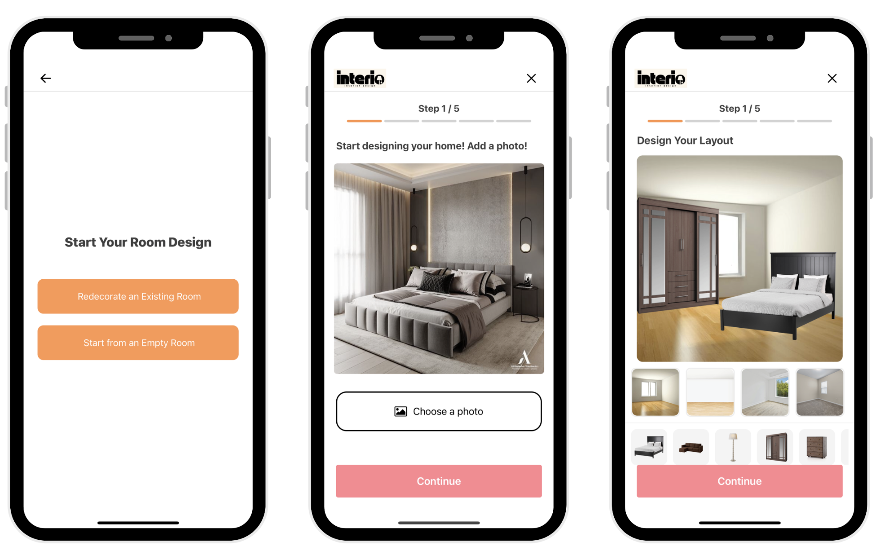
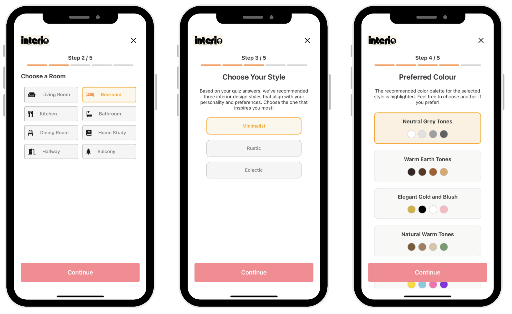
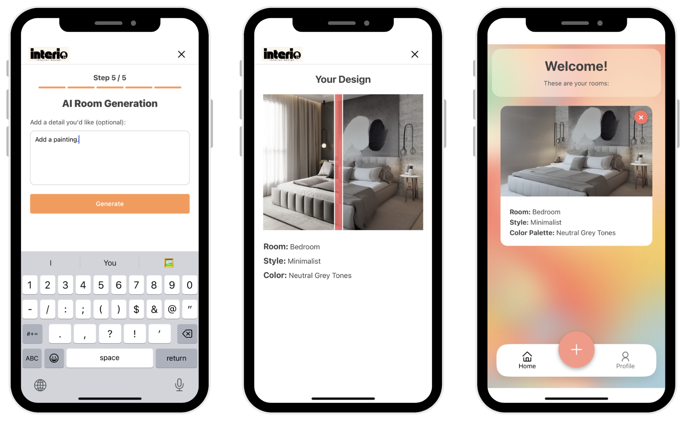

# Interio - Mobile Application

Bachelor’s Thesis — University of Bucharest, Faculty of Mathematics and Informatics (2025)

Author: Ioana Potlog

[Youtube Demo](https://www.youtube.com/watch?v=GOfJv0emvOQ)

## Abstract

Interio is a mobile application that allows users to generate realistic images of their own rooms, redecorated in personalized styles and color palettes. The process begins with a quiz that explores aspects such as lifestyle, aesthetic preferences, and personality traits. Based on the provided answers, an AI classifier identifies the three interior design styles that best match the user’s profile, along with the corresponding color palettes. Next, the user can choose between two methods for configuring the room: either by uploading a real photo of an existing space or by building a schematic layout using an interactive visual editor that allows manual placement of furniture items. In both cases, the resulting image is sent to an AI model that automatically generates a redecorated version, tailored to the selected style and preferences. This functionality provides an interactive experience, helping users visualize how their living space could look in a style that reflects who they are.

## Generate image workflow in app

